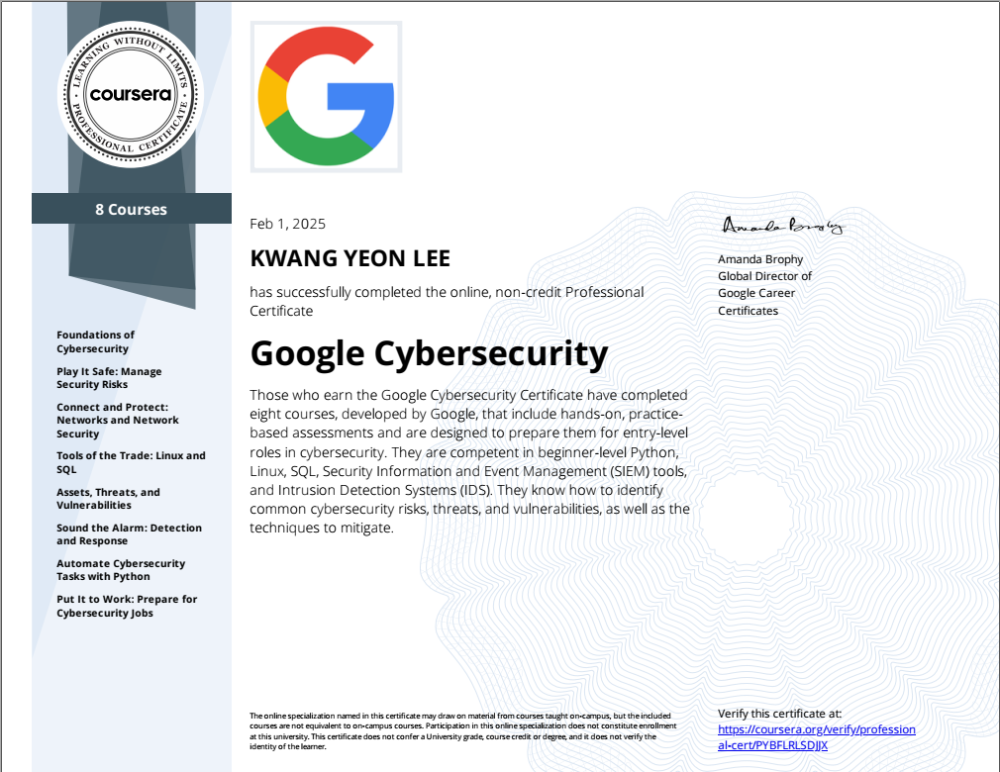

# Kwang Yeon Lee - Cyber Security Portfolio

Certificate for Kwang Yeon Lee, Google Cybersecurity. (https://www.coursera.org/account/accomplishments/specialization/PYBFLRLSDJJX).

Those who earn the Google Cybersecurity Certificate have completed eight courses, developed by Google, that include hands-on, practice-based assessments and are designed to prepare them for roles in cybersecurity. They are competent in Python, Linux, SQL, Security Information and Event Management (SIEM) tools, and Intrusion Detection Systems (IDS). They know how to identify common cybersecurity risks, threats, and vulnerabilities, as well as the techniques to mitigate.

***The focus of this Portfolio was to gather, improve and complete activies related to Cyber Security and presented in Google's Professional Cyber Security Specialization.*** 

This course covered many conceptual topics such as:
  * Risk management
  * Threat analysis
  * Network security
  * Incident response

It also taught me technical skills with:
  * SIEM tools (Splunk)
  * Network protocol analyzers (Wireshark and tcpdump)
  * IDS/IPS tools
  * Firewalls

And I was able to develop even further in the following skills:
<li>Python</li>
<li>SQL</li>
<li>Linux</li>
 

<h2>Contents:</h2>

 

Play It Safe: Manage Security Risks - ✔️
  <li>Risk Assessment & Vulnerability Assessment of financial institution</li>
  <li>Security Audit</li>
  <li>Compliance Checklist</li>
  <li>Controls Assesment Checklist/Priority</li>
  <li>Stakeholders Memorandum</li>
  
 

Connect and Protect: Networks and Network Security - ✔️
  <li>Analyze Network Attacks</li>
  <li>Analysis of Network Hardening</li>
  <li>Analyze Network Layer Communications</li>
  <li>Apply OS Hardening Techniques</li>
  <li>NIST Incident Report Analysis</li>
  
 

Tools of the Trade: Linux & SQL - ✔️
  <li>Manage File Permissions Linux</li>
  <li>Apply Filters to SQL Queries</li>

 

Sound the Alarm: Detection and Response - ✔️
<li>Finalize Incident Handler's Journal</li>

 

Automate Cybersecurity Tasks with Python - ✔️
<li>Update Files through a Python Algorithm</li>
